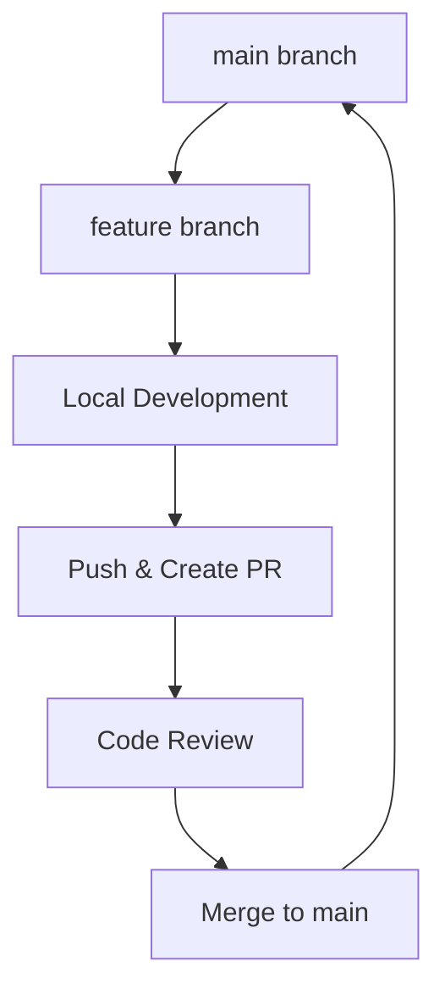

# Git Workflow Guide

## Overview

A practical guide for daily Git operations and workflow.



## 1. Branch Structure

### Main Branch (`main`)
- Production-ready code
- Protected: only lead developer can merge
- All features merge here after review

### Feature Branches
- Format: `feature/<ticket-id>/<short-description>`
- Examples:
  - `feature/ABC-123/user-auth`
  - `feature/DEF-456/payment-integration`
- Restrictions:
  - No uppercase letters
  - No spaces (use hyphens)
  - Keep descriptions brief but meaningful

## 2. Daily Commands

### Basic Workflow
```bash
# Start new work
git checkout main
git pull
git checkout -b feature/ABC-123/description

# Save changes
git add .                    # Stage all changes
git add <file>              # Stage specific file
git commit -m "feat: message"

# Share your work
git push -u origin feature/ABC-123/description  # First push
git push                                        # Subsequent pushes
```

### Keeping Updated
```bash
# Update your branch with main (preferred method)
git fetch
git rebase origin/main

# Alternative method
git checkout main
git pull
git checkout feature/ABC-123/description
git rebase main
```

### Commit Management
```bash
# Fix last commit message
git commit --amend

# Add to last commit without changing message
git add .
git commit --amend --no-edit

# Squash last 3 commits
git reset --soft HEAD~3
git commit -m "feat: combined message"

# Interactive rebase for cleaning history
git rebase -i HEAD~3
```

### Handling Mistakes
```bash
# Undo last commit (keep changes)
git reset --soft HEAD^

# Discard all local changes
git reset --hard HEAD

# Remove staged files
git reset <file>

# Discard local changes in file
git checkout -- <file>

# Remove untracked files
git clean -n  # dry run (show what will be deleted)
git clean -fd # actually delete files
```

## 3. Common Scenarios

### Resolving Merge Conflicts
```bash
# When conflict occurs during rebase
git status                  # Check conflicted files
# Fix conflicts in your editor
git add <resolved-files>
git rebase --continue       # Continue rebase
# Or abort if needed
git rebase --abort

# Use VS Code as merge tool
git config --global merge.tool vscode
git config --global mergetool.vscode.cmd 'code --wait $MERGED'
```

### Stashing Changes
```bash
# Basic stash operations
git stash                   # Stash changes
git stash pop              # Apply and remove last stash
git stash apply            # Apply but keep stash
git stash list             # List all stashes
git stash drop stash@{0}   # Remove specific stash
git stash -u               # Include untracked files
```

### Finding Information
```bash
# View commit history
git log --oneline          # Compact view
git log -p <file>          # Show file changes
git blame <file>           # See who changed what
git show <commit-hash>     # View specific commit

# Search commits
git log --grep="bug fix"   # Search commit messages
git log -S"function name"  # Search code changes
```

## 4. Best Practices

### Commit Messages
- Format: `<type>: <description>`
- Types:
  - `feat`: New feature
  - `fix`: Bug fix
  - `docs`: Documentation
  - `style`: Formatting
  - `refactor`: Code restructuring
  - `test`: Adding tests
  - `chore`: Maintenance
- Examples:
  ```bash
  git commit -m "feat: add user authentication"
  git commit -m "fix: resolve null pointer in login"
  git commit -m "docs: update API documentation"
  ```

### Git Configuration
```bash
# Essential configs
git config --global user.name "Your Name"
git config --global user.email "your.email@company.com"
git config --global core.editor "code --wait"  # Use VS Code
git config --global pull.rebase true          # Rebase on pull

# Useful aliases
git config --global alias.st "status"
git config --global alias.co "checkout"
git config --global alias.br "branch"
git config --global alias.cm "commit -m"
```

## 5. Troubleshooting

### Common Errors

**"Cannot push to remote"**
```bash
# Usually means remote has new changes
git fetch
git rebase origin/main
git push
```

**"Your local changes would be overwritten"**
```bash
# Save your changes first
git stash
git pull
git stash pop
```

**"Unrelated histories"**
```bash
# When combining two independent repositories
git pull origin main --allow-unrelated-histories
```

### Emergency Procedures

**Recover Deleted Commit**
```bash
# Find lost commit
git reflog
# Recover it
git reset --hard <commit-hash>
```

**Undo a Published Merge**
```bash
# Create a revert commit
git revert -m 1 <merge-commit-hash>
```

## Need Help?

### Quick References
- `git status` - Check current state
- `git branch` - List branches
- `git remote -v` - Check remote URLs
- `git diff` - See uncommitted changes

### Common Issues
- Can't push? → Update from main first
- Messy history? → Interactive rebase
- Lost changes? → Check reflog
- Merge conflict? → Resolve file by file

### Git Configuration
```bash
# Show current config
git config --list

# Set up common aliases
git config --global alias.undo 'reset HEAD~1 --mixed'
git config --global alias.amend 'commit --amend --no-edit'
```
